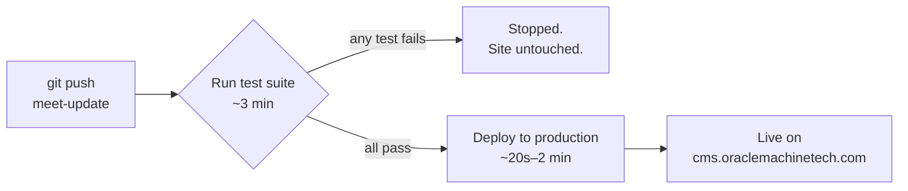

# Deployment Guide — Oracle Machine Tech CRM

**TL;DR:** push your commits to `meet-update`. That's the entire deploy process. Nothing else to run by hand.

```bash
git push origin meet-update
```

---

## How it works



Every push to `meet-update` triggers a pipeline with two stages, run in order:

1. **Run test suite** — installs dependencies fresh and runs the full automated test suite (500+ tests). If anything fails here, the pipeline stops. The live site is never touched.
2. **Deploy to production** — only runs if the tests passed. Connects to the server and, in order:
   - puts the site in maintenance mode
   - pulls the new code
   - installs/updates PHP dependencies
   - runs any new database migrations
   - re-applies the permissions seeder
   - rebuilds config/route/view caches
   - takes the site out of maintenance mode

If any step in the deploy fails partway, the site automatically comes back out of maintenance mode on its own — a failed deploy never leaves the site stuck on a "down for maintenance" page.

---

## Watching a deploy happen

1. Go to the repo on GitHub → **Actions** tab
2. Click the run at the top of the list (it's named after your latest commit message)
3. Watch the two jobs — **Run test suite**, then **Deploy to production** — turn green

A full run typically takes 3–6 minutes.

**✅ Both green** → live, done.
**❌ Red on "Run test suite"** → a test failed; the site was never touched. Read the failure in the log, fix it, push again.
**❌ Red on "Deploy to production"** → something failed on the server side. See **If a deploy fails** below.

---

## Re-running without a new commit

Sometimes useful — e.g. a flaky network blip, or you just want to re-deploy the current code.

**Actions tab → "CI/CD — test and deploy" (left sidebar) → "Run workflow" button → branch: `meet-update` → Run workflow**

---

## What still needs a human

The pipeline handles routine code changes, dependency updates, and database migrations automatically. A few things are intentionally **not** automated:

| Situation | What to do |
|---|---|
| Adding/changing a value in `.env` (API keys, feature flags, etc.) | Edit it directly on the server (SSH or hPanel File Manager). The pipeline deliberately never touches `.env`, so secrets never pass through GitHub. |
| Changing the PHP/Node/Composer version the server runs | hPanel → Advanced → PHP Configuration. Unrelated to the pipeline. |
| A migration that does something unusual (e.g. changing a column's type on a table with real data) | Test it against a copy of production data first if possible — the pipeline runs `migrate --force` unattended, so a migration that would need manual judgment calls should be reviewed carefully before it's ever pushed. |

---

## If a deploy fails

1. Open the failed run in the **Actions** tab and read the log for the step that's red.
2. If it's the **test** job: something in the code broke a test. Standard debugging — fix locally, confirm `php artisan test` passes, push again.
3. If it's the **deploy** job: copy the full error output and bring it to whoever maintains the pipeline (or hand it to Claude — the whole SSH/migration debugging history for this pipeline is preserved and several categories of past failures are already documented, so a similar error is usually fast to diagnose).
4. **The site itself is safe either way** — a failed deploy self-heals out of maintenance mode automatically, so there's no urgency to "fix production" in the moment; take the time needed to diagnose properly.

---

## Reference

| What | Where |
|---|---|
| Pipeline definition | `.github/workflows/deploy.yml` in the repo |
| Deploy branch | `meet-update` |
| One-time setup steps (new machine, rotating the deploy key, etc.) | `docs/deployment/CI-CD-SETUP.md` |
| GitHub secrets (host/port/credentials) | Repo → Settings → Secrets and variables → Actions |
| Live site | https://cms.oraclemachinetech.com |
